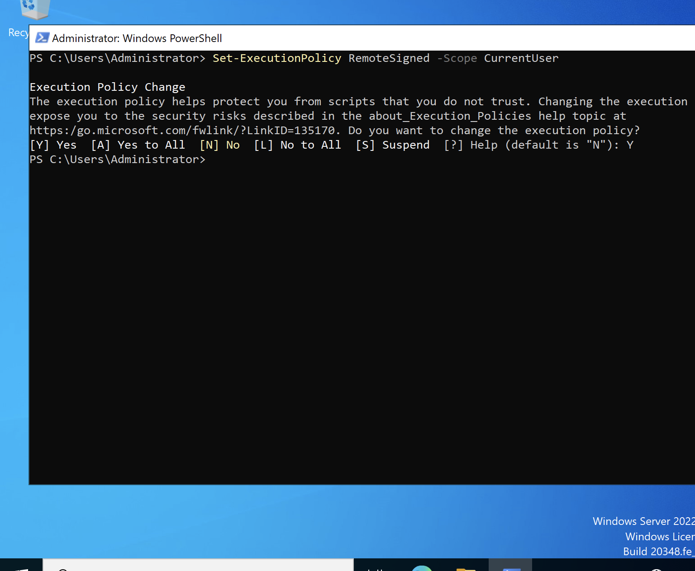
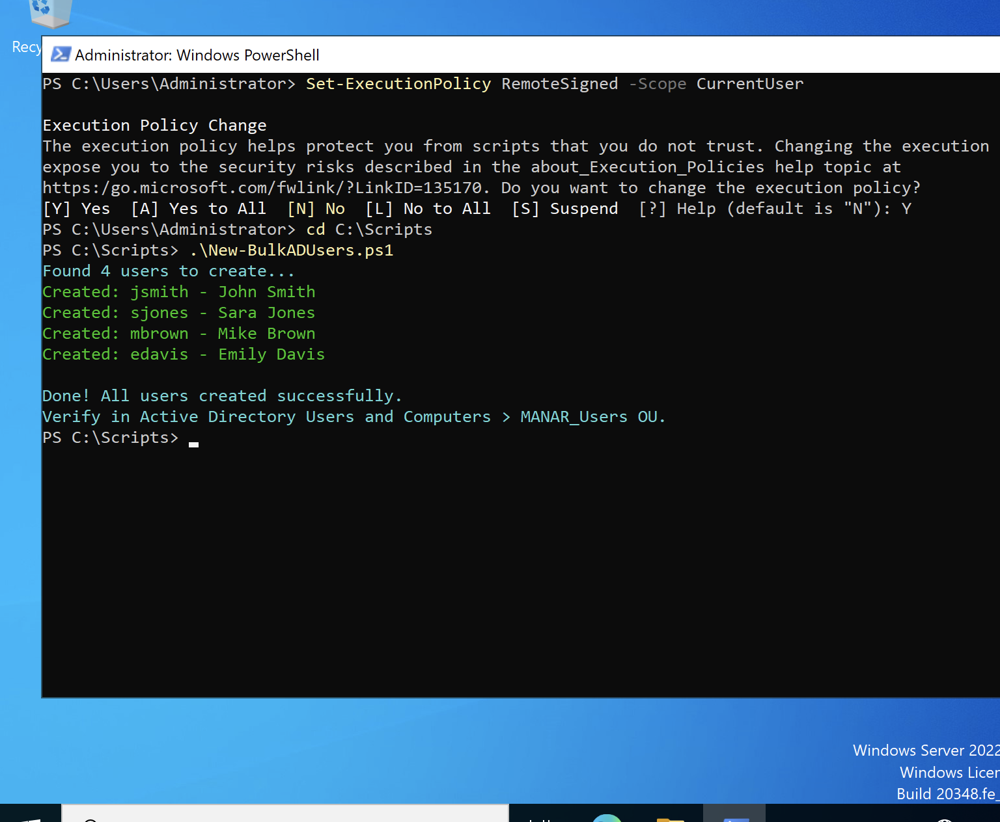
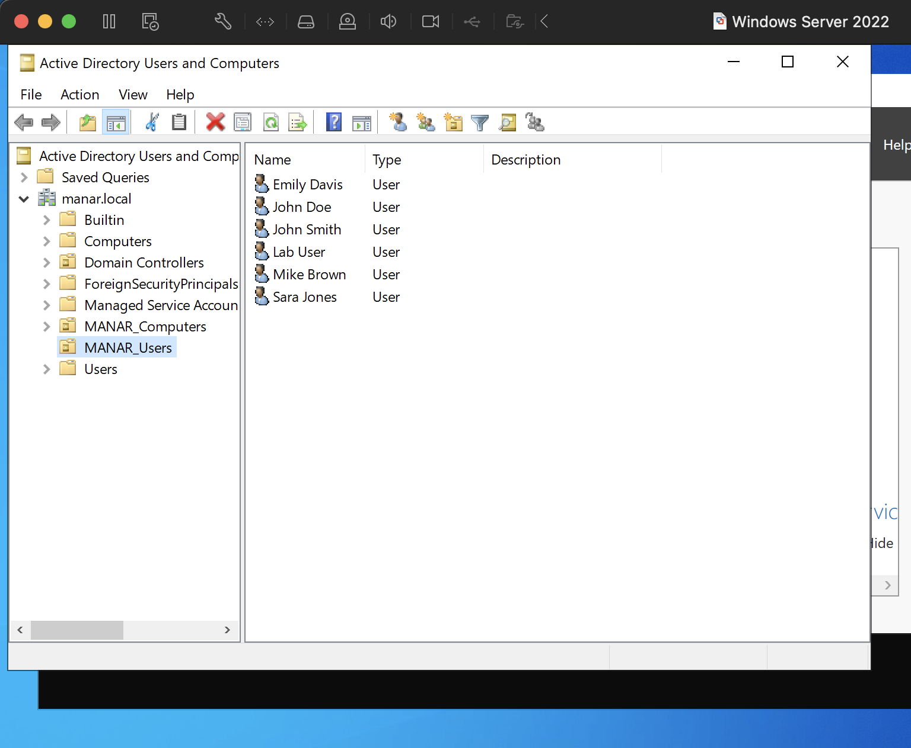
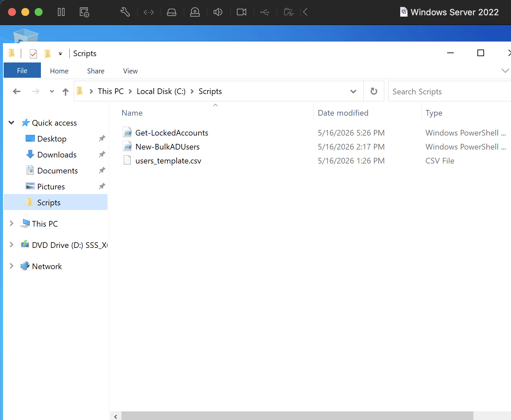
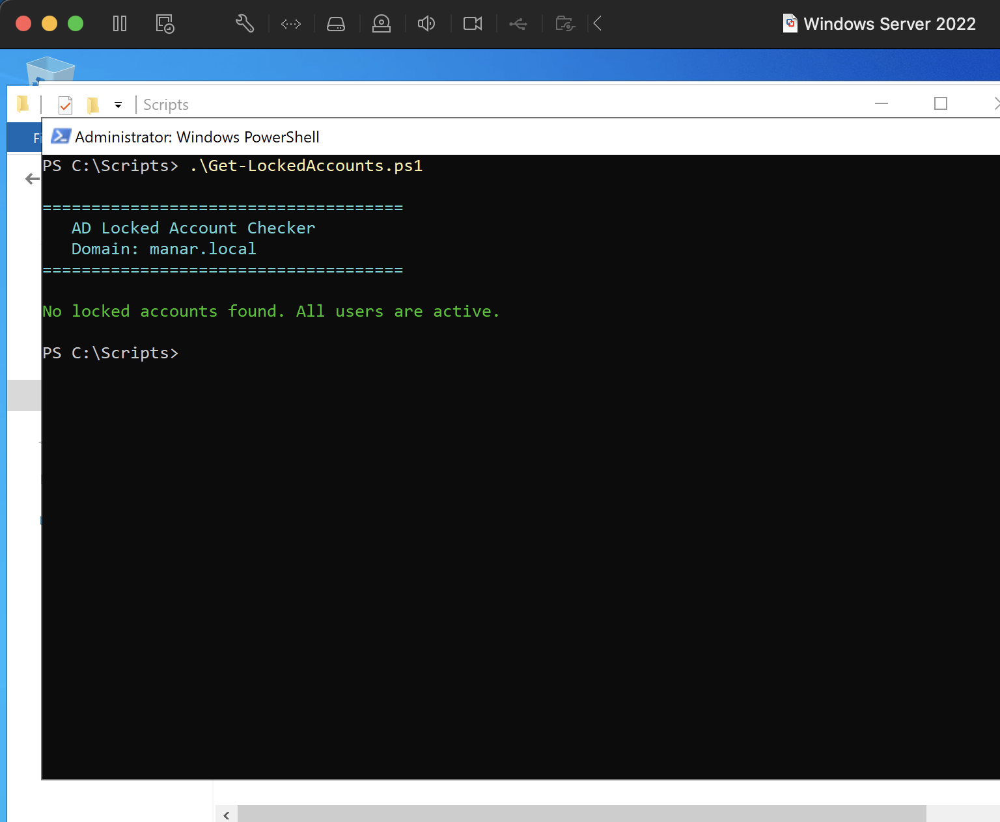
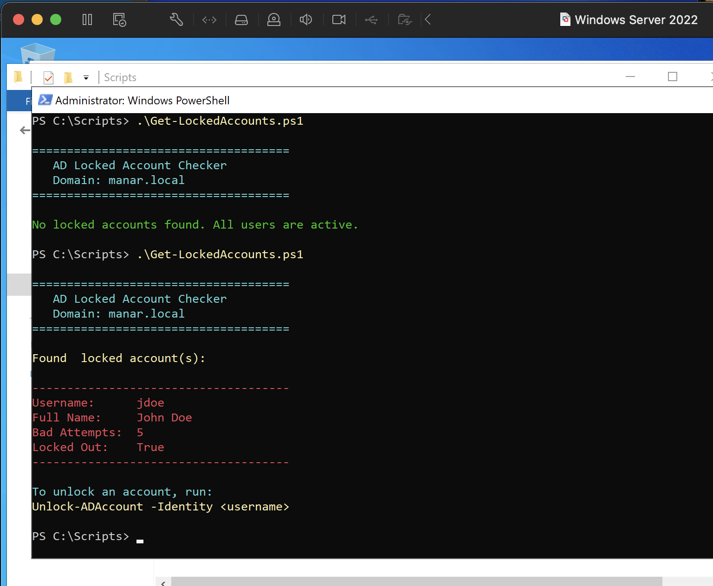
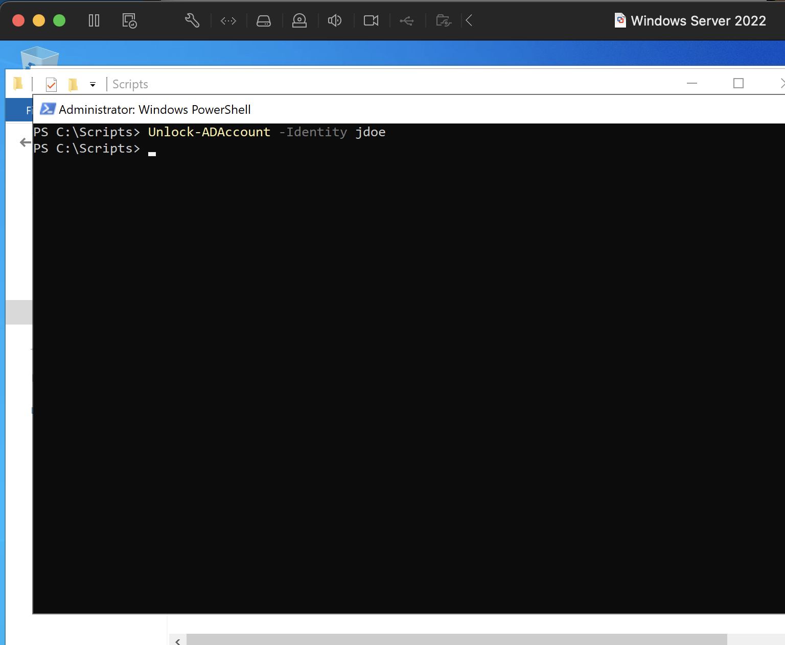
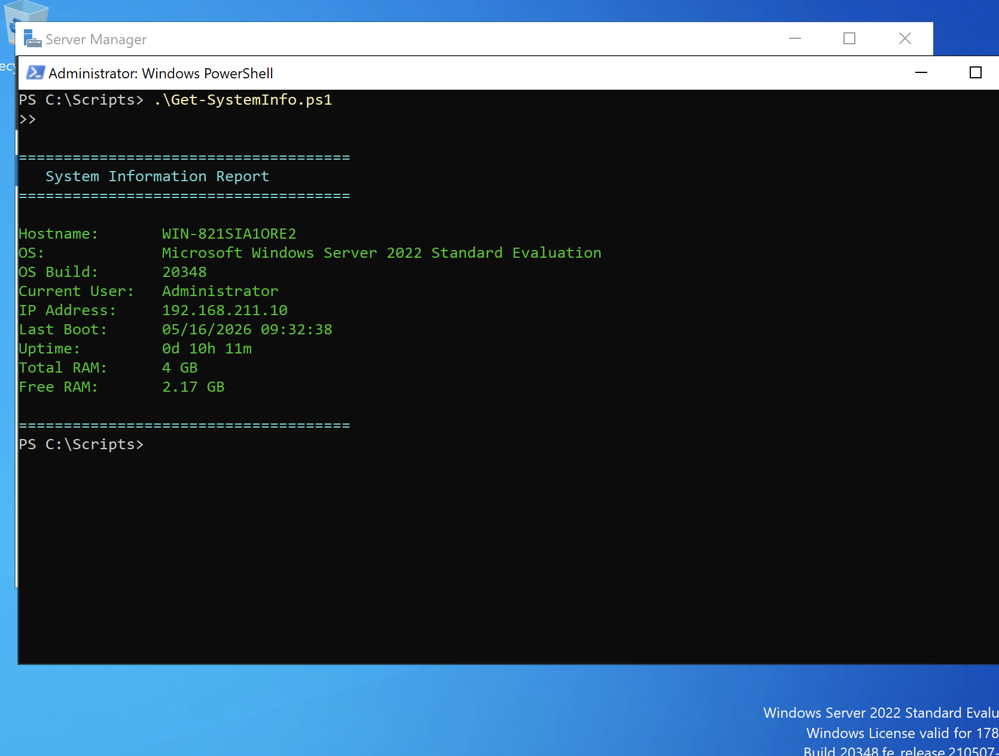

# PowerShell-SysAdmin-Scripts
---

A collection of real-world PowerShell automation scripts for Windows Server 2022 
system administration tasks. All scripts were written, tested, and verified in a 
live Active Directory environment (`manar.local`) running on Windows Server 2022.

These scripts demonstrate the shift from manual point-and-click administration 
to scalable, repeatable automation, a core skill for any sysadmin role.

---

## Environment

| Component | Details |
| :--- | :--- |
| **Server OS** | Windows Server 2022 |
| **Domain** | `manar.local` |
| **Domain Controller** | `WIN-821SIA1ORE2` |
| **Client OS** | Windows 11 |
| **Hypervisor** | VMware Fusion (macOS) |

---

## Scripts

### 1. Bulk AD User Creator
**File:** `Bulk-AD-User-Creator/New-BulkADUsers.ps1`

**The Problem It Solves:**
When a company hires multiple new employees, manually creating each Active Directory 
account one by one through the GUI is time-consuming and error-prone. This script 
reads a CSV spreadsheet and automatically creates all accounts in seconds.

**Real-World Use Case:**
HR provides a spreadsheet of 20 new hires starting Monday. Instead of spending 
2 hours clicking through Active Directory Users and Computers, the sysadmin drops 
the CSV in a folder and runs this script, all accounts exist in under 10 seconds.

**What It Does:**
- Reads user data from a structured CSV file (name, username, department, OU)
- Creates each user account in the correct Organizational Unit automatically
- Sets a starter password and forces a password change on first login
- Enables each account immediately upon creation
- Prints a live status message for each user created

**How To Run:**
1. Edit `users_template.csv` with your user data
2. Open PowerShell as Administrator on the Domain Controller
3. Run:
```powershell
Set-ExecutionPolicy RemoteSigned -Scope CurrentUser
cd C:\Scripts
.\New-BulkADUsers.ps1
```

---

### Step 1: CSV File Created
The ingredient list a structured spreadsheet telling the script who to create 
and where to put them in Active Directory.


---

### Step 2: Execution Policy Configured
Before running any script, Windows requires explicit permission to execute `.ps1` 
files. `RemoteSigned` allows locally written scripts to run freely while still 
blocking untrusted scripts downloaded from the internet.



---

### Step 3: Script & CSV in Place
Both files confirmed in `C:\Scripts` on the Domain Controller and ready to execute.


---

### Step 4: Script Executed Successfully
Running `.\New-BulkADUsers.ps1` from the Scripts folder. The terminal confirms 
all 4 users were created with zero errors.



The output shows:
- Script found **4 users** in the CSV
- Each account was created and confirmed in real time
- No red error text. Clean execution throughout

---

### Step 5: Verified in Active Directory
Final verification in **Active Directory Users and Computers** confirms all 4 
users (John Smith, Sara Jones, Mike Brown, Emily Davis) now exist in the 
`MANAR_Users` OU exactly where the script placed them.



**Script Status: WORKING**

---

## Skills Demonstrated
- PowerShell scripting for Active Directory automation
- CSV data ingestion and bulk object creation
- `New-ADUser` cmdlet with full parameter configuration
- SecureString password handling
- Organizational Unit targeting via Distinguished Names (DN)
- Execution Policy management
- Proactive verification of script results


---

### 2. Locked Account Checker
**File:** `Locked-Account-Checker/Get-LockedAccounts.ps1`

**The Problem It Solves:**
Every morning help desk teams get flooded with "I can't log in" tickets. 
Manually hunting through Active Directory Users and Computers to find locked 
accounts one by one is slow and reactive. This script scans the entire domain 
instantly and reports every locked account with full details before users 
even call in.

**Real-World Use Case:**
A sysadmin runs this script at the start of every shift. Instead of waiting 
for the phone to ring, they already know who is locked, how many bad attempts 
were made, and can proactively reach out to affected users. 5 bad attempts at 
9am means a forgotten password. 50 attempts at 3am means something else entirely.

**What It Does:**
- Scans all Active Directory user accounts domain-wide
- Filters and reports only locked accounts
- Displays username, full name, bad logon attempt count, and lockout status
- Reports a clean bill of health if no accounts are locked
- Reminds the admin of the exact command to remediate each account

**How To Run:**
```powershell
cd C:\Scripts
.\Get-LockedAccounts.ps1
```

---

### Step 1: Script in Place
`Get-LockedAccounts.ps1` saved to `C:\Scripts` alongside the existing scripts.



---

### Step 2: Clean State — No Locked Accounts
First run of the script confirms the domain is healthy. All user accounts 
are active and accessible. This is what a normal morning looks like.



---

### Step 3: Lockout Detected — Live Threat Identified
To demonstrate the detection capability, the `jdoe` account was deliberately 
locked by entering incorrect credentials 5 times on the Windows 11 client. 
Running the script immediately flagged the account.



The script identified:
- **Username:** `jdoe`
- **Full Name:** John Doe
- **Bad Attempts:** 5
- **Locked Out:** True

It also provided the exact remediation command at the bottom, making this 
a complete detection AND guidance tool.

**Note:** This is the same `jdoe` account from Ticket #2 in the 
Troubleshooting-Lab, demonstrating how scripted tools and help desk 
tickets connect in a real environment.

---

### Step 4: Account Remediated via PowerShell
Rather than navigating through the GUI, the account was unlocked directly 
from the terminal using a single command. A blank line with a new prompt 
returned, PowerShell's way of confirming silent success.



```powershell
Unlock-ADAccount -Identity jdoe
```

The script was then run a final time to confirm the domain returned to a 
clean state with no locked accounts remaining.

**Script Status: WORKING**

---

## GUI vs PowerShell — Why This Matters

| | GUI (ADUC) | PowerShell |
| :--- | :--- | :--- |
| **Speed** | 6-8 clicks per user | 1 command per user |
| **Scale** | Manual, one at a time | Loop through 50 users in seconds |
| **Remote** | Requires GUI access to server | Runs from any machine with RSAT |
| **Auditing** | No automatic record | Output can be logged to a file |
| **Scheduling** | Cannot be scheduled | Can run automatically every morning |

In small environments the GUI is common. In enterprise environments 
PowerShell is expected volume, remote access, and auditability make 
it the professional standard.

---

### 3. System Information Report
**File:** `System-Info-Report/Get-SystemInfo.ps1`

**The Problem It Solves:**
Every help desk call starts the same way — "what's your computer name? 
What version of Windows? When did you last restart?" Users never know 
the answers. This script instantly pulls all critical system information 
into a clean, readable report in seconds.

**Real-World Use Case:**
A technician runs this script at the start of a support session to 
immediately know the machine's full profile: hostname, OS version, 
IP address, uptime, and available memory without asking the user 
anything. In larger environments this same script can be run remotely 
across hundreds of machines to build a full hardware and software 
inventory of every device on the network.

**What It Does:**
- Pulls the machine hostname and OS name and build number
- Identifies the current logged in user
- Retrieves the active IPv4 address (filters out loopback automatically)
- Calculates system uptime from last boot time to right now
- Reports total and free RAM in GB
- Runs on any Windows machine: Server or Workstation and no AD required

**How To Run:**
```powershell
cd C:\Scripts
.\Get-SystemInfo.ps1
```

---

### Step 1: Script Executed on Domain Controller
Running the script on the Windows Server 2022 Domain Controller 
produces a full system profile pulled entirely from WMI in seconds.



The report confirms:
- **Hostname:** `WIN-821SIA1ORE2` — the Domain Controller
- **OS:** Microsoft Windows Server 2022 Standard Evaluation
- **OS Build:** 20348
- **Current User:** Administrator
- **IP Address:** `192.168.211.10` — the static DC address configured in Phase 1
- **Last Boot:** 05/16/2026 09:32:38
- **Uptime:** 10 hours 11 minutes
- **Total RAM:** 4 GB allocated to this VM
- **Free RAM:** 2.17 GB currently available

**Script Status: WORKING **

---

## Skills Demonstrated
- PowerShell scripting for Active Directory automation
- Bulk user account creation from CSV data ingestion
- `New-ADUser` cmdlet with full parameter configuration
- `Search-ADAccount` for proactive domain-wide lockout detection
- `Get-ComputerInfo` and `Get-CimInstance` for WMI system queries
- `Get-NetIPAddress` with `Where-Object` filtering
- SecureString password handling
- Distinguished Name (DN) and OU path construction
- Date and memory unit arithmetic in PowerShell
- Execution Policy management
- Proactive vs reactive IT administration mindset
