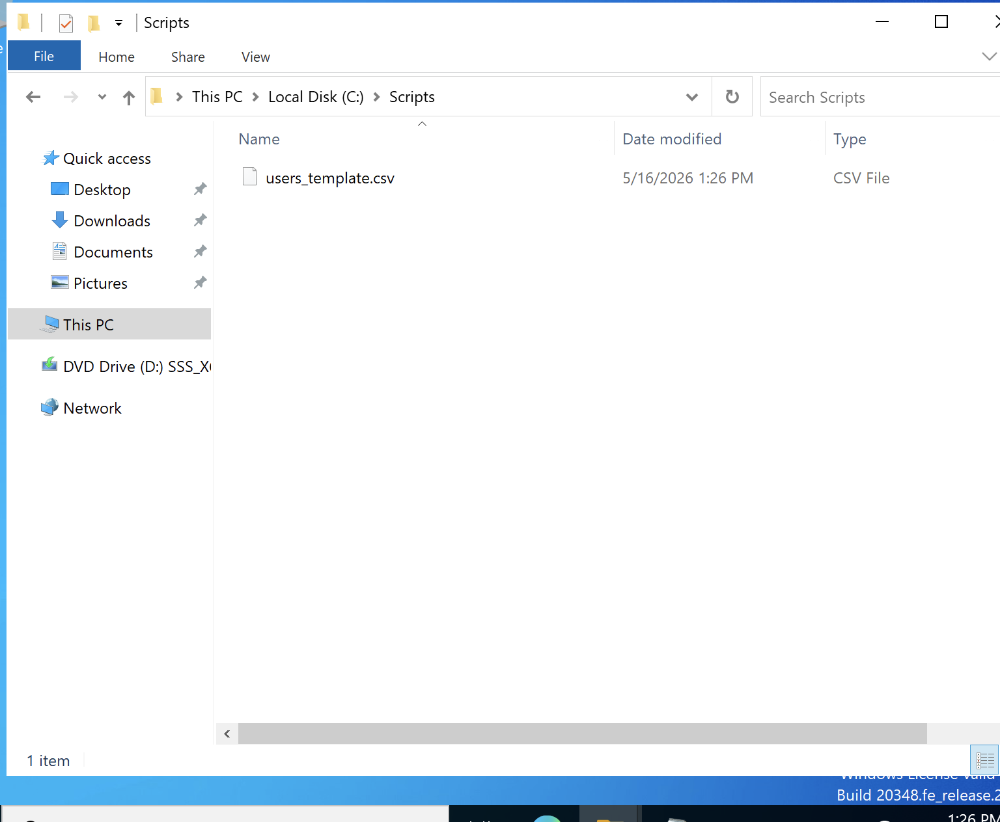
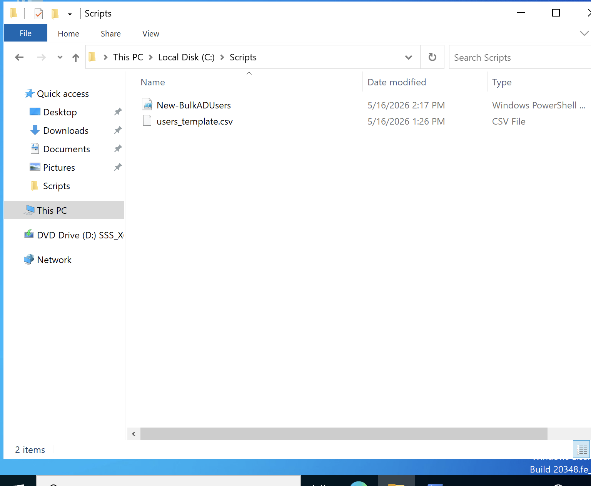

# PowerShell-SysAdmin-Scripts
---

A collection of real-world PowerShell automation scripts for Windows Server 2022 
system administration tasks. All scripts were written, tested, and verified in a 
live Active Directory environment (`manar.local`) running on Windows Server 2022.

These scripts demonstrate the shift from manual point-and-click administration 
to scalable, repeatable automation — a core skill for any sysadmin role.

---

## Environment

| Component | Details |
| :--- | :--- |
| **Server OS** | Windows Server 2022 |
| **Domain** | `manar.local` |
| **Domain Controller** | `WIN-821SIA1ORE2` |
| **Client OS** | Windows 11 |
| **Hypervisor** | VMware Fusion (macOS) |

---

## Scripts

### 1. Bulk AD User Creator
**File:** `Bulk-AD-User-Creator/New-BulkADUsers.ps1`

**The Problem It Solves:**
When a company hires multiple new employees, manually creating each Active Directory 
account one by one through the GUI is time-consuming and error-prone. This script 
reads a CSV spreadsheet and automatically creates all accounts in seconds.

**Real-World Use Case:**
HR provides a spreadsheet of 20 new hires starting Monday. Instead of spending 
2 hours clicking through Active Directory Users and Computers, the sysadmin drops 
the CSV in a folder and runs this script — all accounts exist in under 10 seconds.

**What It Does:**
- Reads user data from a structured CSV file (name, username, department, OU)
- Creates each user account in the correct Organizational Unit automatically
- Sets a starter password and forces a password change on first login
- Enables each account immediately upon creation
- Prints a live status message for each user created

**How To Run:**
1. Edit `users_template.csv` with your user data
2. Open PowerShell as Administrator on the Domain Controller
3. Run:
```powershell
Set-ExecutionPolicy RemoteSigned -Scope CurrentUser
cd C:\Scripts
.\New-BulkADUsers.ps1
```

---

### Step 1: CSV File Created
The ingredient list — a structured spreadsheet telling the script who to create 
and where to put them in Active Directory.



---

### Step 2: Execution Policy Configured
Before running any script, Windows requires explicit permission to execute `.ps1` 
files. `RemoteSigned` allows locally written scripts to run freely while still 
blocking untrusted scripts downloaded from the internet.


---

### Step 3: Script & CSV in Place
Both files confirmed in `C:\Scripts` on the Domain Controller and ready to execute.



---

### Step 4: Script Executed Successfully
Running `.\New-BulkADUsers.ps1` from the Scripts folder. The terminal confirms 
all 4 users were created with zero errors.


The output shows:
- Script found **4 users** in the CSV
- Each account was created and confirmed in real time
- No red error text — clean execution throughout

---

### Step 5: Verified in Active Directory
Final verification in **Active Directory Users and Computers** confirms all 4 
users (John Smith, Sara Jones, Mike Brown, Emily Davis) now exist in the 
`MANAR_Users` OU exactly where the script placed them.


**Script Status: WORKING**

---

## Skills Demonstrated
- PowerShell scripting for Active Directory automation
- CSV data ingestion and bulk object creation
- `New-ADUser` cmdlet with full parameter configuration
- SecureString password handling
- Organizational Unit targeting via Distinguished Names (DN)
- Execution Policy management
- Proactive verification of script results
